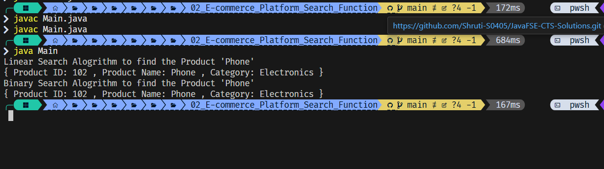

# E-commerce Platform Search Function

This project demonstrates a simple product search functionality for an e-commerce platform using both **Linear Search** and **Binary Search** algorithms in Java.

---

## Features

- Define a list of `Product` items with attributes like `productId`, `productName`, and `category`
- Search for a product by name using:
  - **Linear Search** (unsorted array)
  - **Binary Search** (sorted array using `Comparable`)
- Compare the performance of both algorithms

---
## Comparison
- Linear Search
    - Time Complexity: O(n)
    - When to Use: Small datasets or unsorted arrays

- Binary Search
    - Time Complexity: O(log n)
    - When to Use: Large, sorted arrays

## Output of the application

