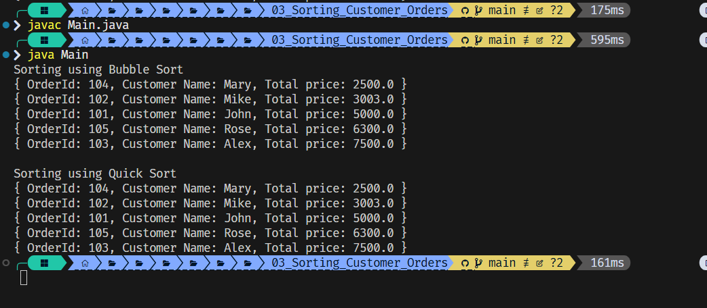

# Sorting Customer Orders

This project demonstrates sorting of customer orders by their **total price** using two popular algorithms: **Bubble Sort** and **Quick Sort**. Sorting orders helps in prioritizing high-value transactions on an e-commerce platform.

---

## Features

- Define a list of `Order` objects with attributes:
  - `orderId`
  - `customerName`
  - `totalPrice`
- Sort the orders based on `totalPrice` using:
  - **Bubble Sort**
  - **Quick Sort**
---

## Sorting Algorithms Used

- **Bubble Sort**
  - Repeatedly compares and swaps adjacent elements if they are in the wrong order
  - Simple and intuitive but inefficient for large data sets

- **Quick Sort**
  - Uses divide-and-conquer strategy with pivot-based partitioning
  - Much faster than Bubble Sort on average, widely used in real-world applications

---

## Output of the application

