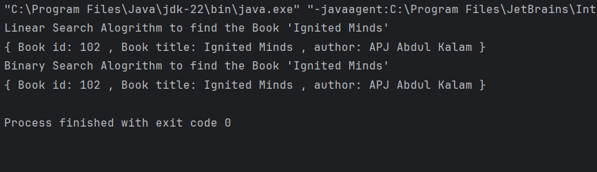

# Library Management System

This project demonstrates a basic **Library Management System** where users can search for books by **title** or **author**. It implements both **Linear Search** and **Binary Search** to compare their performance and use cases.

---

##  Features

- Define a `Book` class with:
  - `bookId`
  - `title`
  - `author`
- Store a list of books in an array
- Implement:
  -  **Linear Search** by book title (unsorted list)
  -  **Binary Search** by book title (sorted list)

---
## Output of the application

