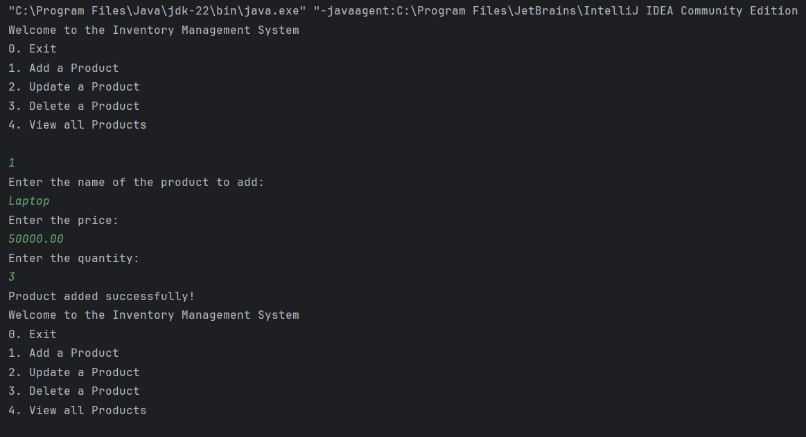
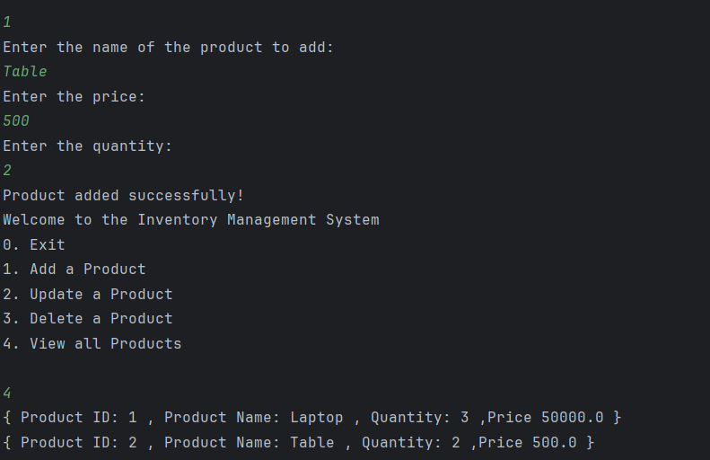

# Inventory Management System

This is a simple console-based Java application to manage inventory for a warehouse. It allows you to add, update, delete, and view products using a `HashMap` for fast access and manipulation.

## 📌 Features

- Add new products
- Update existing product quantity and price
- Delete a product by ID
- View all current products
- Uses `HashMap` for efficient data handling (O(1) operations)

## Output of the application

---

