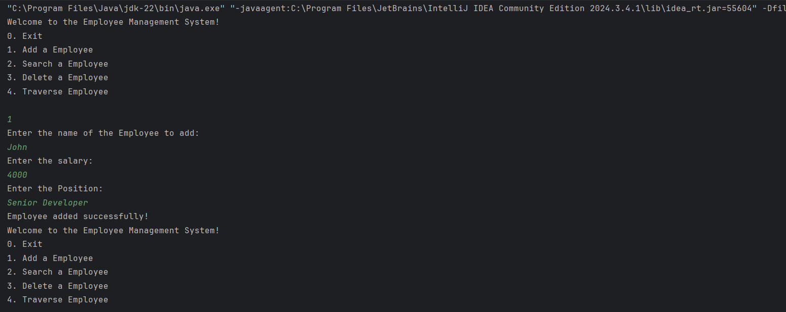
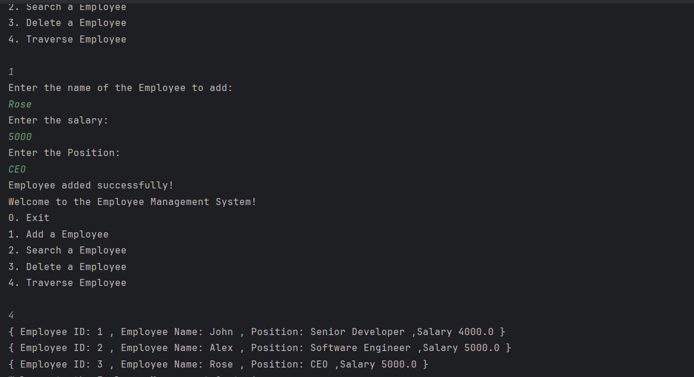

# Employee Management System

This project demonstrates a simple Employee Management System using **arrays** to store and manage employee records. The system includes functionality to **add**, **search**, **traverse**, and **delete** employee entries.

---

## Features

- Define an `Employee` class with:
  - `employeeId`
  - `name`
  - `position`
  - `salary`
- Store employees in an array
- Perform the following operations:
  - ✅ Add a new employee
  - 🔍 Search for an employee by ID
  - 📜 Traverse and display all employee records
  - ❌ Delete an employee by ID

---

> **Limitation**: Arrays are fixed-size. If the array is full, a new larger array must be created and data copied making dynamic operations costly.

---

## When to Use Arrays

- When the number of employees is known or fixed
- When fast, indexed access is required
- When insertion/deletion operations are minimal

---

## Output of the application

---

