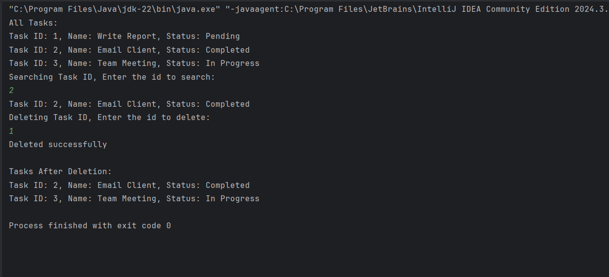

# Task Management System

This project implements a simple **Task Management System** using a **Singly Linked List** in Java. It allows you to add, search, traverse, and delete tasks efficiently, making it ideal for dynamic task management.

---
## Output of the application

---