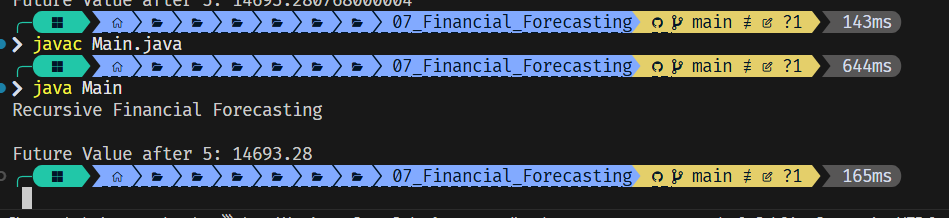

#  Financial Forecasting Tool

This project demonstrates a simple **financial forecasting tool** that calculates the future value of an investment using **recursive algorithms** in Java. 

---

## Features

- Calculate future value based on:
  - `currentValue`
  - `growthRate` 
  - `years`
- Implement:
  -  Recursive forecasting
  -  Optimized forecasting using memoization (caching)

---
## Output of the application

